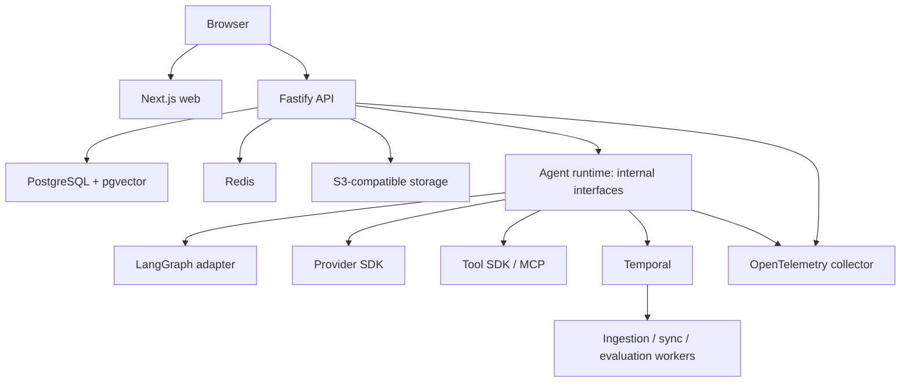
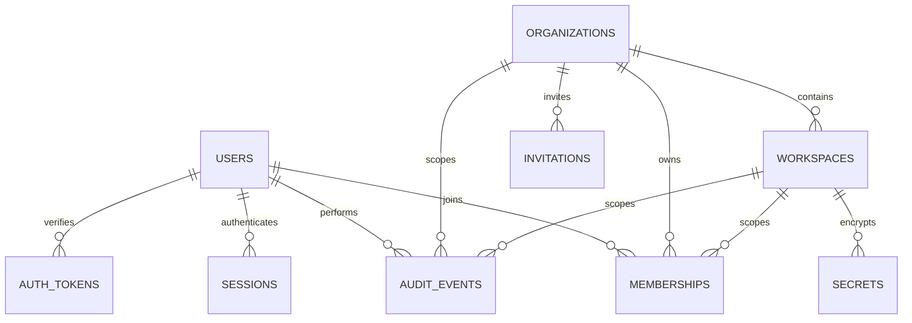
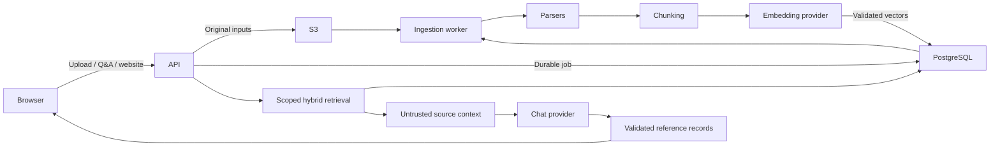

# AgentConnect architecture

AgentConnect is a greenfield, provider-neutral enterprise platform. The supplied specification is retained verbatim in product-spec.md. Implementation proceeds by vertical slices; UI alone does not establish feature completion.

## Foundation boundaries

- `apps/web`: Next.js App Router shell, React, Tailwind, Radix dialogs, React Hook Form, Zod, TanStack Query. Server layout and page wrap interactive workspace views.
- `apps/api`: standalone Fastify service. Owns authentication, authorization, tenant-scoped queries, validation, audit writes, encrypted secrets, email outbox and the streaming/RAG runtime. PostgreSQL is authoritative; Redis provides distributed request rate limits.
- `packages/schemas`: shared domain validation and explicit permission capabilities. Independent of orchestration vendors.
- `packages/db/migrations`: explicit, transactionally applied, numbered PostgreSQL migrations. ORM client is Drizzle; raw SQL queries use postgres tagged parameterization.
- S3-compatible object storage and Temporal development server run separately. Readiness checks exercise both. No agent/runtime worker is created until it has real functionality.
- OpenTelemetry auto-instrumentation exports to a configured OTLP collector. It is opt-in locally; request bodies, headers and secret values are not explicitly recorded.

## Target architecture

`packages/provider-sdk` owns provider protocols and approved HTTP transport. `packages/agent-sdk` owns provider-neutral single-agent execution and prompt rendering. `packages/rag` owns parsing, chunking and the retrieval/citation boundary. `apps/worker` delivers the durable SMTP outbox, ingests knowledge sources and purges deleted source objects. Phase 3 tool policies, MCP client and agent tool orchestration live in tested API modules (`tools.ts`, `tool-runtime.ts`, `web-search.ts`). LangGraph and AI workflow workers in the diagram remain future boundaries.

Future apps: agent-runtime, ingestion, widget. Future extractions: auth, ui, tool-sdk, mcp, observability, security, shared, config. Extract modules when there is tested behavior to share; do not create empty service placeholders.

## Initial database ERD

Workspace composite foreign keys prevent ownership mismatch. Organization-level owner/admin membership grants access to all workspaces. Other roles require explicit workspace membership. Invite acceptance never upgrades an existing role. Authorization is deterministic and runs before each tenant data operation. RLS is a hardening task; the current DB account is for a trusted API only.

## Decisions

1. Use immutable relational identity and tenant ownership from the first migration.
2. Store hashes of session, invite, verification and reset tokens. Use seven-day sessions, one-hour auth tokens, seven-day invitations.
3. Use AES-256-GCM envelope encryption: a fresh data key per value, wrapped by the configured local master key. Bind ciphertext to tenant/resource context using authenticated additional data. Production KMS adapter and key rotation remain required before enterprise deployment.
4. SameSite/HttpOnly cookies plus strict write Origin checks. Production requires HTTPS origin and SMTP. No LLM is involved in authorization.
5. Keep Phase 0 usable without model-provider credentials. No model behavior is simulated.
6. Durable AI workflows are deferred to their slice. Temporal is provisioned and connectivity-tested now.

7. Pin development container images by digest. Temporal dev-server binds to 0.0.0.0 and its internal worker must reach that local address without the outbound proxy. Compose explicitly bypasses the proxy for loopback/wildcard bind addresses only.

## Knowledge flow

Ingestion currently uses PostgreSQL leases/outbox jobs. Temporal remains provisioned and connectivity-tested for later durable graph workflows. Website and model destinations have separate server allowlists and share the inherited cloud outbound proxy.

Phase 4 adds a React Flow canvas and workspace workflow API. Immutable graphs reference published agent versions; the worker compiles them to LangGraph with PostgreSQL checkpoints in a dedicated schema. SQL leases and guarded status changes coordinate execution, cancellation and approval/resume. Node traces persist values, durations, reported usage and citations; tool executions also reference their workflow run and node. See workflows.md for graph constraints and recovery semantics.

## Offline quality flow

The Quality lab stores revisioned datasets and immutable evaluation inputs in PostgreSQL. A leased worker reuses standard agent retrieval/tool/provider execution, checkpoints each case, applies deterministic checks and an optional registered LLM judge, then persists aggregate metrics and baseline deltas. Pricing is frozen at queue time; unreported usage remains unknown. Administrator-controlled publication gates compare completed runs to the current saved draft, dataset revision, evaluator and dependency fingerprint inside the publication transaction. See [quality.md](quality.md) for recovery, permission boundaries and initial scope.

## Enterprise source sync

A tenant-scoped connector registry binds an approved remote endpoint and encrypted workspace credential to a knowledge base. Adapter interfaces return a complete bounded inventory and conditionally read document versions. A leased worker persists per-key fingerprints, queues existing knowledge ingestion jobs, and reconciles remote removals only after a successful full scan. Manual and scheduled refresh use the same queue; role rechecks, connector revisions and lease tokens guard mutations. The first adapter uses signed read-only S3 requests through the existing safe HTTP transport. See [connectors.md](connectors.md) for constraints and follow-up providers.

The Google Drive source adapter extends the same connector inventory/read boundary. It selects a tenant-encrypted service-account JSON key, signs a read-only JWT, exchanges it at a fixed OAuth endpoint, and refreshes the in-memory access token before expiry. Complete bounded folder traversal and native document exports feed existing knowledge ingestion; binary checksums and before/after metadata guard changed downloads. Google source URLs remain attached to documents and citations. The adapter cannot override endpoint hosts from credential fields or follow Drive shortcuts. Imported documents inherit destination knowledge access rather than per-user Google ACLs.

The OneDrive for Business adapter uses tenant-specific Entra application credentials selected from encrypted workspace secrets. Fixed Microsoft login and Graph endpoints handle token exchange and bounded drive/folder metadata reads. Graph pagination stays within the selected child endpoint, and remote-item shortcuts cannot expand the source tree. Original documents enter the existing leased ingestion pipeline with stable Graph web URLs. Signed content redirects require an exact public HTTPS endpoint grant and use a separate transport with no Graph authorization or private-host exceptions; temporary download URLs are never persisted. Size, available checksums and before/after metadata guard download races. Existing connector cancellation, schedules, revision checks and managed-only reconciliation apply unchanged.

SharePoint discovery uses the selected workspace Entra credential and administrator connector-management capability. The API resolves a supplied public-cloud site URL through Graph, enumerates bounded site libraries and browses folders after verifying library membership. Foreign/looping pagination and mismatched site metadata fail without partial choices. The UI confirms a specific folder and clears discovery state when credentials or source inputs change. SharePoint sync binds the existing document adapter to a site and checks membership before and after inventory. A shared Microsoft Graph client provides token renewal, bounded responses, safe errors and fixed credential destinations for both Microsoft adapters; signed downloads retain their separate authorization-free public transport. Discovery does not search all tenant sites or create provider permissions.

Teams and Slack adapters import bounded complete channel message/reply inventories as plain-text knowledge sources through the existing connector worker. Teams reuses the Graph application client; Slack validates the selected token workspace and channel membership. Snapshots use content hashes, preserve message/thread provenance and never write to either provider. Externally shared Slack and non-standard Teams channels are rejected.

Readiness uses a separate bounded PostgreSQL probe pool, concurrent dependency checks with abort/deadline enforcement, shared in-flight requests and a two-second cache. Required migration/version checks are shared with the migration CLI. Deployment preflight additionally checks the runtime database role and known credential placeholders without mutating infrastructure.

Workspace retention uses daily/manual policy-revision jobs and PostgreSQL transactions to delete eligible history and LangGraph checkpoint payloads. Conversation activity timestamps and shared writer locks protect recently used or active conversations. Generated-object deletion is an independent durable outbox with bounded S3 calls and retries, committed atomically with artifact registry removal and cleanup audit counts. See retention.md for supported data categories and lifecycle limits.

## Support conversation control

The [support foundation](human-support.md) introduces tenant-scoped cases, queues and append-only events. Conversation mode is authoritative; AI and support actions serialize on the same conversation lock. Legacy channel routes project this domain for existing clients.

## Support console projection

Migration 0018 adds private support notes. A bounded server projection merges agent messages and support events into one chronological staff timeline, retaining case boundaries. Notes are referenced by note-created events; public channel adapters continue to expose only customer-visible support events.

Human Support Phase C uses a dedicated `support/routing.ts` domain and a worker loop over the durable queued-case backlog. Configuration remains in PostgreSQL: existing-user profiles, scoped presence TTL, skill proficiency, languages, queue membership and scoring weights. Routing filters eligibility before scoring; manual assignments and automatic routing reserve capacity under the same workspace transaction advisory lock, acquired after conversation/case locks. Assigned cases reserve capacity before acceptance. Per-queue timestamps persist round-robin fairness, case retry timestamps prevent backlog starvation, and routing explanation snapshots remain in append-only support history.

Phase D separates current policy evaluation/customer consent from asynchronous private triage. Policies resolve deterministically by deployment, agent and workspace scope. Chat completion records bounded trigger signals and offers; confirmation locks the conversation and records its policy snapshot. Leased worker jobs call provider-neutral adapters outside locks, validate strict triage/brief output and persist private provenance before releasing deterministic routing. Provider failures preserve queue/manual service. See [handoff policies](human-support.md#phase-d-escalation-policy-and-ai-handoff).
