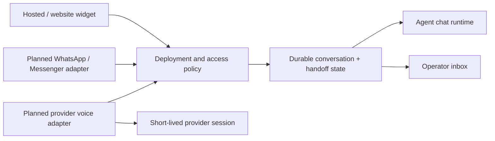

# Phase 7: web channels, browser voice and human support

This initial release adds a standalone website widget, browser dictation/playback in agent playground and hosted chat, and a durable human support inbox. WhatsApp/Messenger adapters and provider-backed speech/real-time sessions remain planned integrations. No messaging credentials or live speech provider were configured for this release.

## Upgrade

Run `pnpm db:migrate` to apply migration 0009, then restart services. Existing public deployments keep their hosted URLs, with embedding disabled by default. Existing conversations are backfilled as playground or hosted; new widget conversations record their channel and embedding origin. No new server secret is required for the supported features.

## Embed an agent

1. Publish the saved agent and create a hosted deployment under Agents → Publish.
2. Open **Channels**, expand the deployment, and enable the website widget. Administrators manage these settings; operations readers can inspect them.
3. Keep **Specific origins** selected and enter exact origins, for example `https://www.example.com`. Include a non-default port if used. Wildcards, paths and opaque origins are rejected. HTTPS is required except for explicit local development origins such as `http://localhost:4500`. Alternatively, deliberately select **Any HTTPS website** for public embedding.
4. Choose theme, launcher text, position, greeting, dimensions and language, then save. Copy the generated script into the website before its closing body tag. Do not put API keys in the script. In production the API URL must be publicly reachable over HTTPS; allow that URL in the website's script/connect CSP directives.
5. Open the website, send a question, and inspect the conversation in the workspace. Conversations can be filtered by **Website widget**.

The lightweight JavaScript bundle isolates its styles in a shadow root, fits mobile screens and renders text through text nodes. It displays the textual summary of generative output; full charts/forms/downloads remain in hosted chat, which starts a separate conversation. Opening full chat does not transfer widget history or tokens. The deployment ID is public, not a credential. The bundle permits cross-origin loading; this exception applies only to its static script.

Widget metadata/chat/handoff routes check origin and deployment status on the server. CORS permits the exact approved origin without cookies, with no relaxation of private workspace APIs. A conversation's opaque guest token remains in memory and is additionally bound to its deployment, channel and exact origin. Reloading starts a new conversation. Changing settings or disabling the deployment blocks future widget requests, including an existing conversation; it does not forcibly abort an in-flight provider call. Hosted chat remains separately accessible until the deployment itself is disabled. Origin checks constrain browser embedding; they are not user authentication and a non-browser client can supply an Origin header. Public endpoints need normal abuse controls; chat has the existing 20/minute IP route limit and handoff writes 30/minute.

## Browser voice

In playground or hosted chat, select **Enable browser voice**. Choose a speech language, click **Dictate message**, review/edit the transcript, then send it. Dictation never automatically submits. Click **Read latest response** to start playback; **Stop voice** interrupts recognition/playback. Disabling voice or leaving the view stops it. Unsupported browsers show the typing fallback. Microphone permission failure is displayed without disabling typed chat.

These controls use the browser's SpeechRecognition and SpeechSynthesis APIs, not the model's voice capabilities. Browsers may send audio to their own speech services; the UI discloses this before dictation. Browser/device/service support varies and normally requires a secure context. The application stores a transcript only after it is sent as a chat message. It does not receive or store raw microphone audio, mint speech-provider session keys or stream bidirectional audio. Playback is limited to the latest textual response. Browser API fixtures verify UI behavior, not actual microphone capture or real speech-service acceptance.

## Human support

After a conversation begins, a visitor can **Request human support** in the widget, playground or hosted chat. The request moves the conversation to pending and pauses agent execution. Requests during an active agent run return 409; wait for it to finish. The visitor can leave support messages while waiting.

Operators open **Channels → Human support inbox**, select the conversation and inspect its agent history. **Join support conversation** marks it active; **Send operator reply** stores a human response, which visitors receive through five-second polling. **Resolve and return to agent** closes the handoff and enables new agent messages. There is no staffing notification or guaranteed response time. Handoffs and support replies survive server restarts; the current browser's conversation token does not survive reload.

Only the private conversation owner or the matching guest token can request a handoff or leave visitor messages. Current `handoff:manage` grants allow owners, organization/workspace administrators, builders and operators to join/reply/resolve. Analysts can read context and open requests but cannot reply. A pending handoff can be claimed once atomically. Migration 0017 introduces an exclusive assignee: only that operator or an administrator supervisor can reply or resolve. State changes and agent-run creation use the same conversation row lock; the authoritative conversation mode blocks automated execution while support has control. Changes by signed-in users are audited without copying support message content into the audit record.

Support events form a separate thread rather than modifying model-generated messages or usage totals. The latest 500 events are returned, and the inbox shows at most 100 open requests. After resolution the model retains its prior agent conversation history; human replies are not silently injected into its prompt. This release supports explicit visitor requests, not model-triggered escalation, routing/assignment, notifications, or a persistent visitor inbox. Production retention and richer pagination remain follow-up work.

## Messaging and real-time voice architecture

The existing chat runtime is shared by hosted and widget channels. External messaging and provider real-time voice should enter through authenticated adapters rather than broadening browser routes.

The following contract is a design for subsequent implementation, not active connector behavior:

- Messaging adapters validate vendor verification challenges and raw-body webhook signatures before tenant lookup or dispatch. Workspace-owned encrypted credentials identify the connection; a unique connection/vendor-message ID provides durable deduplication. Normalize only validated sender/channel IDs into a tenant-bound conversation. Queue acknowledgements and outbound deliveries durably, respecting vendor reply windows, retries and delivery status. Human replies use the same channel adapter, not a browser-only guest token.
- STT/TTS adapters select independently registered speech-capable providers/models/voices. Upload limits, format checks, transcript confirmation, quota and retention apply independently from LLM output token budgets. Credentials stay server-side. Voice-provider endpoint approval uses the existing server network policy.
- Real-time voice creation authorizes a specific active published deployment, origin, user/guest conversation and speech capability. The server uses its workspace credential to mint a short-lived, narrowly scoped provider session token; it never exposes the long-lived key. WebRTC is preferred for supported providers. Session state tracks language, voice, system prompt, response style, VAD, interruptibility, turn/cancel events, provider usage and bounded expiry. Disconnect, disablement and handoff end the audio session. Only explicitly accepted transcripts enter durable conversation history; raw audio retention requires a separate configured policy.

Live WhatsApp/Messenger configuration needs vendor application approval, account/page/phone IDs, encrypted credentials, signature secrets, a publicly reachable HTTPS callback and permitted vendor API destinations. Those prerequisites are not supplied by the browser voice feature. Agent/workflow API keys from Phase 5 remain execution-only; no channel administration scope was added.

## Support foundation upgrade

Migration 0017 evolves legacy handoffs through a shared support-case service. Assigned operators now have exclusive control, with administrator supervision. Existing widget and hosted endpoints remain supported. See [the support roadmap and compatibility details](human-support.md).

## Dedicated staff console

The first-class **Human Support** section replaces the Channels inbox as the primary staff workflow. The older inbox remains compatible. Customer-visible replies remain available after resolution; internal notes and private summaries are never returned to customer channels. See [human support](human-support.md).
